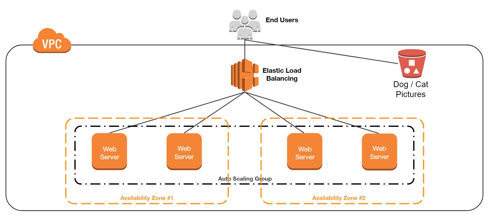

# cloud-talk-cats-or-dogs

Demo Infrastructure as Code for Cloud Talk series

## Overview

This project demonstrates Infrastructure as Code principles using Terraform
and Salt. The Terraform modules will create and manage the following resources:

* IAM Instance Role
* S3 Bucket
* Application Load Balancer
* Security Groups (1 for the load balancer and 1 for EC2 instances)
* Autoscaling Group and Launch Config

Salt is used within the EC2 instances (deployed by the Autscaling Group) to
install and configure an Apache web server. The web server will serve cat or
dog images from the S3 bucket. One Availability Zone will be designated as the
"cats AZ", and any EC2 instance running in that AZ will only serve cat images.
Instances in any other AZ will serve only dog images. This is intended to help
demonstrate the failover and recovery capabilities of the architecture.

  

## Usage

1. Create a `main.auto.tfvars` file in the `main` module. See [`main/variables.tf`](main/variables.tf)
   for the required and optional variables. This file is ignored intentionally
   by source control so it is not committed to the project.

2. The first time the project is deployed, execute the following `make` targets
   in the listed order. For subsequent executions, execute the targets as needed
   depending on the changes being evaluated. See [Make Targets][#make-targets]
   for more info on the available targets.

   * `make test`
   * `make apply/iam`
   * `make apply/bucket`
   * `make apply/main`

## Terraform Modules

All resources are deployed using Terraform. The project consists of 3 Terraform
modules:

* [iam](./iam)
  * Manages the IAM Instance Role
* [bucket](./bucket)
  * Manages the S3 bucket
* [main](./main)
  * Manages all other resources, including the objects in the S3 bucket
  * Utilizes the [`lx-autoscale`][lx-autoscale] module from [`terraform-aws-watchmaker`][terraform-aws-watchmaker]

[lx-autoscale]: https://github.com/plus3it/terraform-aws-watchmaker/tree/master/modules/lx-autoscale
[terraform-aws-watchmaker]: https://github.com/plus3it/terraform-aws-watchmaker

> **NOTE**: The `iam` and `bucket` modules must be deployed first, as their
resources must exist when the `main` module is deployed.

## Make Targets

There is a `Makefile` that helps manage the project workflow.. The following
`make` targets are supported:

* `make test`
  * Runs `terraform fmt` to standardize format of all Terraform files.
  * Runs `terraform validate` on all modules to check for syntax errors.
* `make <tf_command>/<module>`
  * Executes the `<tf_command>` in the specified `<module>`. The command `init`
    supports an additional argument `upgrade=<true|false (default)>`, which
    controls whether to force terraform to re-download all providers and modules
    (see `terraform init -help`).
* `make <tf_command>/all`
  * Executes the `<tf_command>` in all Terraform modules. This target does not
    account for dependencies between modules, so should not be used for `plan`,
    `apply`, or `destroy` commands. `init` and `validate` are safe.
